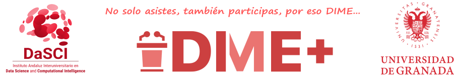

# DIME+ 
Evaluation model with linguistic scales using the multimoora method. It is implemented as web based framework, API rest and native apps for iOS and Android. It is called DIME+ 

This program is designed to generate a ranking, based on evaluations given by the attendees of scientific dissemination events. It is contemplated that most of these events are part of citizen science projects.
The evaluation of each event is given in linguistic scales, and the multimodal method is used to generate the rankings.

## Slogan

## DaSCI at NIGHTspain 2023
We have use DIME+ with [NIGHTspain as case use](Use-case/DaSCI-Night23.md)
Hemos usado DIME+ para [el caso de uso NIGHTspain](Use-case/DaSCI-LaNoche2023.md)
